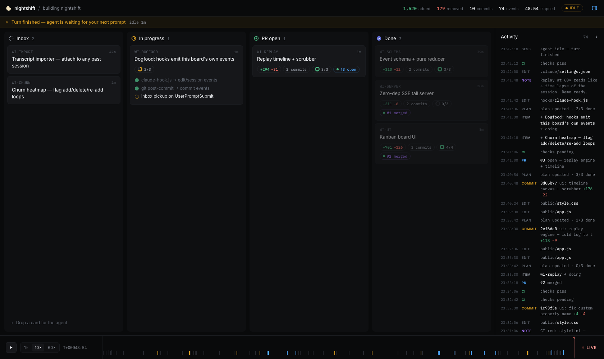
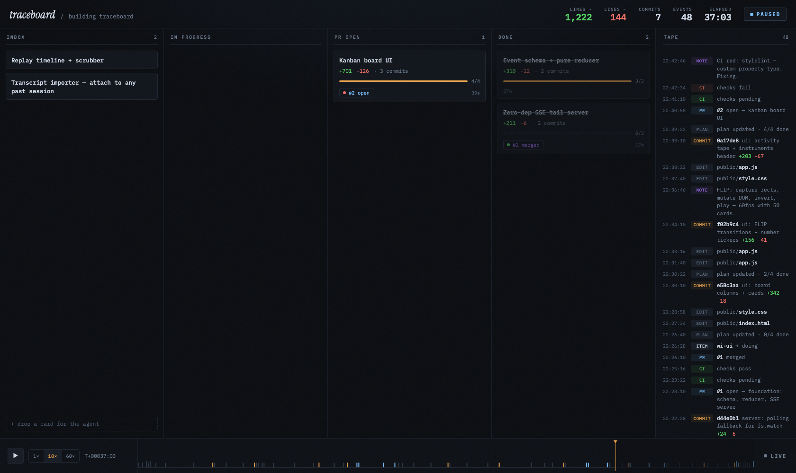

# nightshift

A live flight recorder for AI agent sessions. Work items move across a kanban
board, line counts tick with every commit, and the whole session can be
replayed from a timeline scrubber — all rendered from a single append-only
event log.



Most agent boards are orchestrators: the board exists first and dispatches
agents to cards. nightshift is the inverse — **observability first**. The
session already exists; the board is a pure visualization of its traces. Facts
(commits, file edits, session lifecycle) are emitted deterministically by git
and Claude Code hooks. Intent (work items, milestones) is emitted by the agent
on purpose. The model is never responsible for keeping the board honest.

## Quickstart

```sh
git clone https://github.com/Restuta/nightshift
cd nightshift
npm run demo        # synthesizes a 48-minute session, serves it at :4173
```

Open http://localhost:4173 — you'll see the final state of a session in which
nightshift built itself. Press **▶** to replay it from the start at 10× or
60×; drag on the timeline to scrub anywhere. Zero dependencies, no build step:
plain Node ≥ 18.



## How it works

```
  facts                      intent
  ─────                      ──────
  git post-commit hook       agent runs tools/emit.js
  claude code hooks               (item / note events)
        │                          │
        └──────────┬───────────────┘
                   ▼
      .nightshift/events.jsonl          ← append-only, the only contract
                   │
                   ▼
        server.js (SSE tail)            ← zero-dep static + event stream
                   │
                   ▼
        state = fold(events[0..t])      ← pure reducer, public/reducer.js
                   │
                   ▼
        board · tape · timeline         ← live is t=now, replay is any t
```

The reducer being pure over the log is the load-bearing design decision:
live mode and time travel are the same code path evaluated at different `t`.
The corollary (see [docs/EVENTS.md](docs/EVENTS.md)) is that external facts —
CI status, PR state — are *recorded as events*, never fetched at render time.
Replaying yesterday's session must show yesterday's CI status.

## Attaching to a real session

One command:

```sh
npm run attach -- /path/to/project
node server.js --log /path/to/project/.nightshift/events.jsonl
```

`attach` vendors a self-contained kit into `<project>/.nightshift/` (Claude
Code hook, git post-commit hook, `emit.js`), merges the hook wiring into the
project's `.claude/settings.json` without touching what's there, installs the
git hook, and gitignores the log. Idempotent — rerun it after updating
nightshift. From then on, Claude Code sessions in that project emit `session` /
`edit` / `todos` events and every commit emits line counts, no matter who
commits. Optionally teach the agent the intent layer (see the dogfooding
protocol in [CLAUDE.md](CLAUDE.md)): one `item` event per PR-sized deliverable.

The board is also **bidirectional**: type into the inbox column and the card is
appended to the log; the `UserPromptSubmit` hook surfaces open inbox cards to
the agent as context at the start of its next turn.

## Importing a past session

No hooks in place when the session ran? Synthesize the tape after the fact —
Claude Code transcripts (`~/.claude/projects/<munged-cwd>/<session-id>.jsonl`)
and Codex rollouts (`~/.codex/sessions/YYYY/MM/DD/rollout-*.jsonl`) are both
read, format auto-detected:

```sh
npm run import -- <session.jsonl>
node server.js --log .nightshift/import-<id>.jsonl
```

Human prompts, file edits, todos, and agent questions are read from the
transcript. Commit facts — sha, message, line counts — come straight from
`git log` over the session's time window (the session's cwd when it's a repo,
or `--repo <path>`) instead of being parsed out of model output, so the
tickers show exactly what git recorded.

## Which agent is on shift?

`session` events carry an `agent` field, rendered as a badge next to the
session title — ✳ Claude in terracotta, ⬢ Codex in steel blue. The Claude
hooks and both importers set it automatically. For live Codex sessions the
surface is thinner (Codex has no per-tool hooks): point `notify` in
`~/.codex/config.toml` at `hooks/codex-notify.js` to get turn-completion and
approval-request events; for the full picture, import the rollout afterwards.

## Event vocabulary

`session` · `item` · `todos` · `edit` · `commit` · `pr` · `ci` · `note` —
envelope, semantics, and the attribution heuristic are specified in
[docs/EVENTS.md](docs/EVENTS.md). Unknown types are ignored by design, so the
vocabulary can grow without breaking old logs.

## Roadmap

- [x] Transcript importer — synthesize a board from any past Claude Code
      session JSONL, no hooks required (attach retroactively)
- [x] PR/CI poller — record GitHub facts as events (`pr`, `ci`) automatically
      (`node tools/poll-github.js`, gh-based, appends only deltas)
- [x] Churn heatmap — hot-files strip in the tape; repeat-edit counts in three
      heat tiers, the visual signature of an agent flailing
- [ ] Multi-session switcher — one server, many tapes
- [ ] Shareable replays — export a tape + static player

## License

MIT
